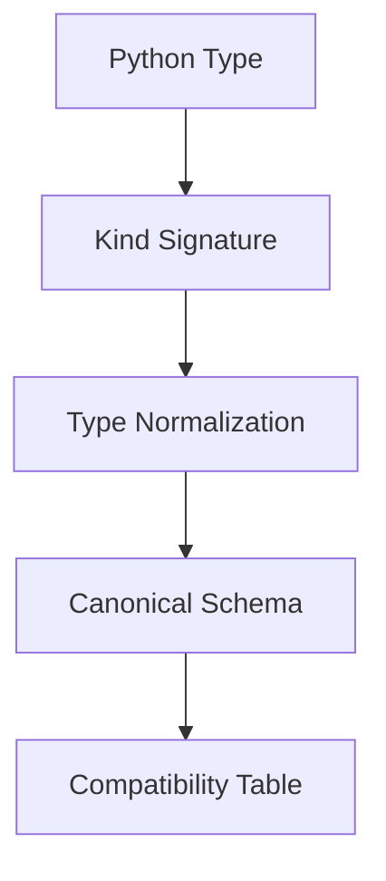

# ZVIC (Zero-Version Interface Contracts)

This document provides a concise, LLM-oriented summary of ZVIC: both the project and the paradigm of Zero-Version Interface Contracts. ZVIC is a project that enables and enforces the ZVIC paradigm. This summary is intended to help LLMs understand, reason about, and generate code or documentation that aligns with these principles and requirements.

## What is ZVIC?

ZVIC is both a project and a paradigm for safe, dynamic code reuse in distributed Python systems. As a project, ZVIC implements and enforces the Zero-Version Interface Contracts paradigm.

## ZVIC: Project and Paradigm

- Eliminates the need for semantic versioning.
- Interface stability is ensured through signature hashes and runtime checks.
- Contracts are verified dynamically at runtime, not by version numbers.
- Fail-fast: incompatible changes are detected and reported immediately.
- ZVIC (the project) provides tools and runtime enforcement for the ZVIC paradigm.

## Canonicalization & Compatibility Pipeline

## Kind Signature Canonicalization

| Parameter Kind         | Names Matter? | Canonical ID By           | Compatible on Name Change? | Compatible on Type Change? | Compatible on Default Change? |
|-----------------------|:-------------:|---------------------------|:--------------------------:|:--------------------------:|:-----------------------------:|
| Positional-only       | No            | Order + Kind + Type       | ✅ Yes                     | ❌ No                      | N/A                           |
| Positional-or-keyword | Yes           | Name + Kind + Type + Default | ❌ No                  | ❌ No                      | ❌ No                         |
| Keyword-only          | Yes           | Name + Kind + Type + Default | ❌ No                  | ❌ No                      | ❌ No                         |
| *args                 | No            | Kind + Type               | ✅ Yes                     | ❌ No                      | N/A                           |
| **kwargs              | No            | Kind + Type               | ✅ Yes                     | ❌ No                      | N/A                           |

## Type Normalization Table (Core Types)

| Python Type         | Canonical Kind | Normalized Schema Example           |
|--------------------|---------------|-------------------------------------|
| `int`              | `*`           | `{type: integer}`                   |
| `List[int]`        | `* → *`       | `{type: array, items: {type: integer}}` |
| `dict`             | `* → * → *`   | `{type: object, properties: ...}`   |
| `np.int32`         | `*`           | `{type: integer, format: int32}`    |
| `MyClass`          | `*`           | `{type: object, class: MyClass}`    |

## Parameter Compatibility Matrix: Type Signatures

| ID  | Scenario                        | Example                  | Compatible? | Reasoning                                  |
|-----|----------------------------------|--------------------------|-------------|---------------------------------------------|
| T0  | Untyped/Any → Specific type      | A: Any → B: int          | ✗           | Type constraint added                       |
| T1  | Same type                        | A: int → B: int          | ✓           | Exact match                                 |
| T2  | Base → Derived (narrowing)       | A: Animal → B: Cat       | ✗           | New function requires specific subtype      |
| T3  | Interface → Concrete             | A: Sized → B: list       | ✗           | Implementation restricts valid inputs       |
| T4  | Type → Wider union               | A: int → B: int\|str     | ✓           | Accepts original type + more                |
| T5  | Required → Optional              | A: int → B: int\|None    | ✓           | Original callers already pass required type |
| T6  | Implicit conversion              | A: int → B: float        | ✗           | No explicit subtype relationship            |
| T7  | ABC hierarchy                    | A: Integral → B: Real    | ✓           | Explicit subtyping via ABCs                 |
| T8  | Adjacent types                   | A: uint8 → B: uint16     | ✗           | Behavioral differences matter               |
| T9  | Derived → Base (widening)        | A: Cat → B: Animal       | ✓           | Contravariant parameter acceptance          |
| T10 | Container invariance             | A: list[int] → B: list[str] | ✗       | Generic parameters invariant                |
| T11 | Container contravariance         | A: list[Dog] → B: list[Animal] | ✓   | List of Dog is compatible with list of Animal |

## Constraint Signature Compatibility Matrix

| ID  | Scenario                        | Example                        | Compatible? | Reasoning                                  |
|-----|----------------------------------|--------------------------------|-------------|---------------------------------------------|
| C0a | No constraint in A, no in B      | A(a:int) -> B(a:int)           | ✓           | No constraints to break compatibility       |
| C0b | Same constraint in A and B       | A(a:int(_ <10)) -> B(a:int(_ <10)) | ✓      | Exact match, no issues                     |
| C1  | No constraint in A, any in B     | A(a:int) -> B(a:int(_ <20))    | ✗           | Passing anything to A outside constraints will break B |
| C2  | Any constraint in A, no in B     | A(a:int(_ <10)) -> B(a:int)    | ✓           | No constraints in B, so A can pass anything|
| C3  | Wider constraint in B            | A(a:int(_ <10)) -> B(a:int(_<20)) | ✓      | B accepts more than A, so A can pass anything|
| C4  | Narrower constraint in B         | A(a:int( _ <20)) -> B(a:int(_ <10)) | ✗   | Some inputs that A accepts will not be accepted by B |

## References

| Topic                | Spec Section                                  |
|----------------------|-----------------------------------------------|
| SDFP Principles      | [specs/spec-02-SDFP-Principles.md](specs/spec-02-SDFP-Principles.md) |
| ZVIC Contracts       | [specs/spec-03-ZVIC-Contracts.md](specs/spec-03-ZVIC-Contracts.md)   |
| Canonicalization     | [specs/spec-04-Canonicalization-Compatibility.md](specs/spec-04-Canonicalization-Compatibility.md) |
| Error Handling       | [specs/spec-03-ZVIC-Contracts.md](specs/spec-03-ZVIC-Contracts.md)   |
| Test Plan            | [specs/spec-08-Test-Plan.md](specs/spec-08-Test-Plan.md)            |
