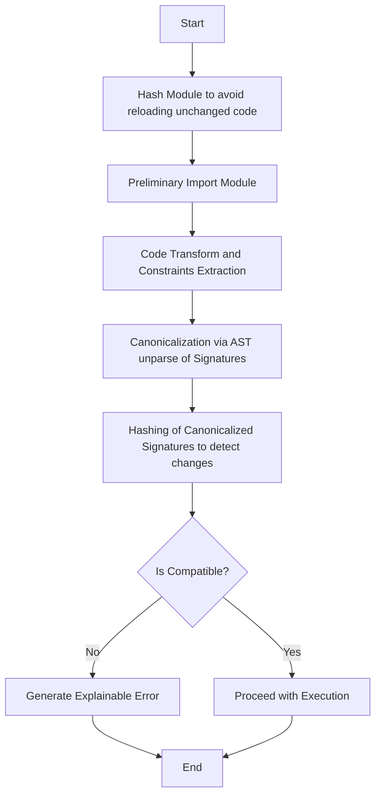

# ZVIC Abstract Type Compatibility Model

## 1. Purpose & Scope

This document introduces the ZVIC abstract type compatibility model, a ground-up reimplementation with no legacy or migration support. It defines the new formalism, architecture, and developer experience for type compatibility in dynamic Python systems.

**Scope:**
- Formal kind system for higher-kinded types (HKTs)
- Trait-style protocol coherence and attribute ownership
- Contextual (static/dynamic) verification and evidence tracking
- Gradual typing and partial type support
- Pythonic, ergonomic API for all operations

**Audience:**
Developers, architects, and tool authors building or integrating dynamic, distributed Python systems requiring robust, migration-free type compatibility.

---

## 2. Model Overview

ZVIC eliminates versioning, migration, and legacy compatibility. All compatibility is determined by structural and contextual analysis of types, protocols, and evidence. The model is designed for clarity, extensibility, and production-grade ergonomics.

---

## 3. Key Innovations

- **Kind Signatures:** Formal kind system for HKTs, with normalization and arity checks
- **Trait-Style Protocols:** Attribute ownership and coherence registry for protocol safety
- **Contextual Verification:** Static/dynamic context with proof obligation tracking
- **Gradual Typing:** PartialType wrapper for incomplete or evolving types
- **Pythonic API:** Decorators, transparent conversion, and REPL/debug support

---

## 4. Core Definitions

- **KindSignature:** Formal descriptor of type constructor arity and structure (e.g., `* → * → *` for `dict`)
- **ProtocolCoherence:** Registry and enforcement of attribute ownership for protocols
- **VerificationContext:** Tracks static/dynamic mode and proof obligations
- **PartialType:** Wrapper for types with unknown or partial information
- **TypeRep:** Canonical, normalized representation of any type

---

## 5. Flow Overview

## 6. Quick Reference

| Topic                | Spec Section                                  |
|----------------------|-----------------------------------------------|
| SDFP Principles      | [Spec 02: SDFP Principles](spec-02-SDFP-Principles.md) |
| ZVIC Contracts       | [Spec 03: ZVIC Contracts](spec-03-ZVIC-Contracts.md)   |
| Canonicalization     | [Spec 04: Canonicalization & Compatibility](spec-04-Canonicalization-Compatibility.md) |
| Error Handling       | [Spec 03: ZVIC Contracts](spec-03-ZVIC-Contracts.md)   |
| Developer API        | [Spec 02: SDFP Principles](spec-02-SDFP-Principles.md) |

---
