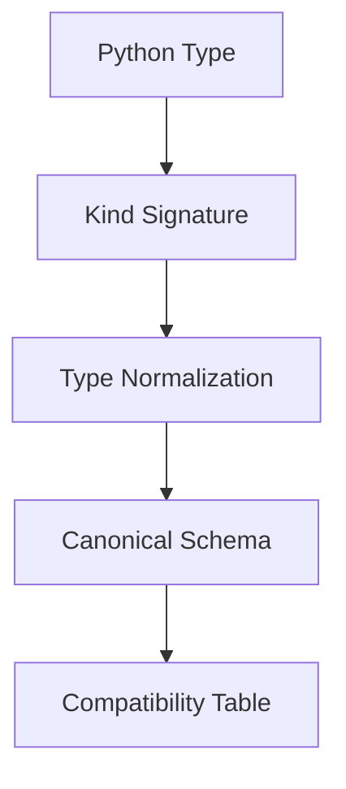

# Spec 04: Canonicalization & Compatibility

## Canonicalization Strategy

In ZVIC, all type and function signatures are canonicalized using kind signatures, type normalization, and protocol evidence. Canonicalization is context- and kind-aware, and does not support legacy or migration logic.

### Kind Signature Canonicalization

| Parameter Kind           | Names Matter? | Canonical ID By           | Compatible on Name Change? | Compatible on Type Change? | Compatible on Default Change? |
|-------------------------|:-------------:|---------------------------|:--------------------------:|:--------------------------:|:-----------------------------:|
| Positional-only         | No            | Order + Kind + Type       | ✅ Yes                     | ❌ No                      | N/A                           |
| Positional-or-keyword   | Yes           | Name + Kind + Type + Default | ❌ No                  | ❌ No                      | ❌ No                         |
| Keyword-only            | Yes           | Name + Kind + Type + Default | ❌ No                  | ❌ No                      | ❌ No                         |
| *args                   | No            | Kind + Type               | ✅ Yes                     | ❌ No                      | N/A                           |
| **kwargs                | No            | Kind + Type               | ✅ Yes                     | ❌ No                      | N/A                           |

*Adding an optional positional-or-keyword parameter is compatible only if it has a default value.*

### Canonical Representation Examples

| Function Definition | Canonical Representation |
|---------------------|-------------------------|
| `def process(a: int, b: int, /) -> float:` | `{ "name": "process", "params": [ {"kind": "POSITIONAL_ONLY", "type": "int"}, {"kind": "POSITIONAL_ONLY", "type": "int"} ], "return": "float" }` |
| `def transform(data: dict, verbose: bool = False) -> list:` | `{ "name": "transform", "params": [ {"kind": "POSITIONAL_OR_KEYWORD", "name": "data", "type": "dict"}, {"kind": "POSITIONAL_OR_KEYWORD", "name": "verbose", "type": "bool", "default": "False"} ], "return": "list" }` |
| `def render(*, width: int, height: int) -> Image:` | `{ "name": "render", "params": [ {"kind": "KEYWORD_ONLY", "name": "width", "type": "int"}, {"kind": "KEYWORD_ONLY", "name": "height", "type": "int"} ], "return": "Image" }` |

### Compatibility Matrix

| Change Type                | Positional-only | Positional-or-keyword | Keyword-only |
|----------------------------|:--------------:|:---------------------:|:------------:|
| Name change                | ✅ Yes         | ❌ No                 | ❌ No        |
| Type change                | ❌ No          | ❌ No                 | ❌ No        |
| Default value change       | N/A            | ❌ No                 | ❌ No        |
| Add optional param         | N/A            | ✅ Yes*               | ❌ No        |
| Add required param         | ❌ No          | ❌ No                 | ❌ No        |

*Only compatible if new parameter has a default value*

---

## Type Normalization Layer

All types are normalized to a canonical, extensible schema. This supports HKTs, partial types, protocols, and custom formats. No legacy or migration logic is present.

### Type Mapping Table (Examples)

| Python/Other Type         | Normalized Schema Example                                 |
|--------------------------|----------------------------------------------------------|
| `int`                    | `{ "type": "integer" }`                                 |
| `float`                  | `{ "type": "number" }`                                  |
| `str`                    | `{ "type": "string" }`                                  |
| `bool`                   | `{ "type": "boolean" }`                                 |
| `numpy.int32`            | `{ "type": "integer", "format": "int32" }`             |
| `numpy.float64`          | `{ "type": "number", "format": "double" }`             |
| `ctypes.c_uint32`        | `{ "type": "integer", "format": "uint32_t" }`           |
| `List[int]`              | `{ "type": "array", "items": {"type": "integer"} }`    |
| `MyDataClass`            | `{ "type": "object", "class": "MyDataClass", ... }`     |

### Extensibility
- **Kind Registry:** Users can register new kind signatures for custom HKTs.
- **Format Registry:** Users can register new formats (e.g., `"format": "uuid"`, `"c_type": "uint16_t"`).
- **Shape Metadata:** Arrays and tensors can include a `"shape"` field (e.g., `{"type": "array", "items": ..., "shape": [3,3]}`).
- **Custom Classes:** Fallback to `{ "type": "object", "class": ... }` with optional `properties`.
- **Recursive Types:** Use `$ref` and `definitions` for recursive/nested types (JSON Schema style).

### Canonicalization & Normalization Pipeline

#### Type Normalization Table (Core Types)

| Python Type         | Canonical Kind | Normalized Schema Example           |
|--------------------|---------------|-------------------------------------|
| `int`              | `*`           | `{type: integer}`                   |
| `List[int]`        | `* → *`       | `{type: array, items: {type: integer}}` |
| `dict`             | `* → * → *`   | `{type: object, properties: ...}`   |
| `np.int32`         | `*`           | `{type: integer, format: int32}`    |
| `MyClass`          | `*`           | `{type: object, class: MyClass}`    |

#### Extensibility Table

| Feature         | Registry/Field         | Example Value                |
|-----------------|------------------------|------------------------------|
| Kind Registry   | `kind`                 | `* → *`                      |
| Format Registry | `format`               | `uuid`, `uint16_t`           |
| Shape Metadata  | `shape`                | `[3,3]`                      |
| Custom Classes  | `class`, `properties`  | `MyClass`, `{...}`           |
| Recursion       | `$ref`, `definitions`  | `#/$defs/MyType`             |

---

This approach ensures that all contract types—no matter how complex or domain-specific—can be reduced to a uniform, extensible schema for compatibility checking, documentation, and agent/UI consumption.

---

See also: [Spec 01: Introduction](spec-01-Introduction.md), [Spec 02: SDFP Principles](spec-02-SDFP-Principles.md), [Spec 03: ZVIC Contracts](spec-03-ZVIC-Contracts.md), [Spec 07: Annotation Constraints](spec-07-Annotation-Constraints.md)
