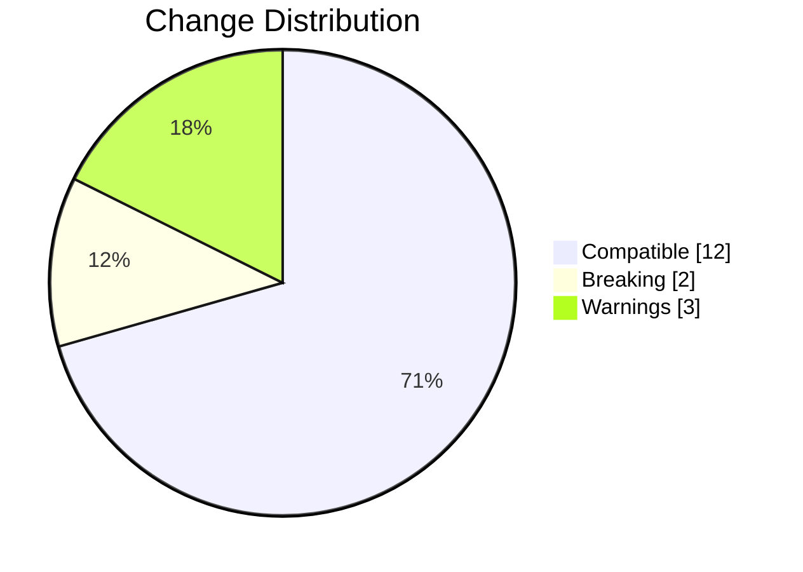
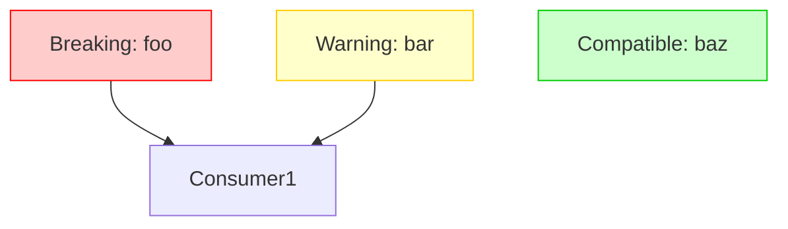

# ZVIC Contract Diff Visualization: Design & Implementation

Based on your insight that diff visualization is crucial for compatibility analysis, I'll design a comprehensive visualization system that integrates directly with ZVIC's compatibility reports.

## Core Visualization Components

### 1. Multi-Level Diff Representation

```python
def visualize_diff(compatibility_report: dict, detail_level: str = "summary") -> str:
    """
    Generate visual diff based on compatibility report
    :param detail_level: 'summary' | 'function' | 'parameter'
    """
    output = []

    # Summary visualization
    if detail_level == "summary":
        output.append(f"## Contract Compatibility Summary")
        output.append(f"🟢 Compatible: {len(compatibility_report['compatible']} items")
        output.append(f"🔴 Breaking: {len(compatibility_report['breaking'])} changes")
        output.append(f"🟡 Warnings: {len(compatibility_report['warnings'])}")
        output.append("```mermaid\npie showData\n    title Change Distribution\n    \"Compatible\" : {compatible}\n    \"Breaking\" : {breaking}\n    \"Warnings\" : {warnings}\n```")

    # Function-level diff
    elif detail_level == "function":
        for item in compatibility_report['diffs']:
            if item['change_type'] == 'removed':
                output.append(f"### ❌ Removed: {item['name']}")
                output.append(f"```diff\n- {item['old_signature']}\n```")
            elif item['change_type'] == 'added':
                output.append(f"### ⭐ Added: {item['name']}")
                output.append(f"```diff\n+ {item['new_signature']}\n```")
            elif item['change_type'] == 'modified':
                output.append(f"### 🔄 Modified: {item['name']}")
                output.append(render_signature_diff(item['old_signature'], item['new_signature']))

    # Parameter-level diff
    elif detail_level == "parameter":
        for item in compatibility_report['diffs']:
            if item['change_type'] == 'modified':
                output.append(f"### 🔍 {item['name']} Parameter Changes")
                output.append(render_parameter_diff(item['param_diffs']))

    return "\n".join(output)

def render_signature_diff(old_sig: dict, new_sig: dict) -> str:
    """Visualize function signature differences"""
    diff = []
    # Function name
    if old_sig['name'] != new_sig['name']:
        diff.append(f"- Name: {old_sig['name']} → {new_sig['name']}")

    # Parameters
    param_lines = []
    for i in range(max(len(old_sig['params']), len(new_sig['params']))):
        old_param = old_sig['params'][i] if i < len(old_sig['params']) else None
        new_param = new_sig['params'][i] if i < len(new_sig['params']) else None

        if not old_param:
            param_lines.append(f"+ [New] {format_param(new_param)}")
        elif not new_param:
            param_lines.append(f"- [Removed] {format_param(old_param)}")
        elif old_param != new_param:
            param_lines.append(f"~ [Changed] {format_param(old_param)} → {format_param(new_param)}")
        else:
            param_lines.append(f"  {format_param(old_param)}")

    diff.append("Parameters:")
    diff.append("```diff\n" + "\n".join(param_lines) + "\n```")

    # Return type
    if old_sig['return'] != new_sig['return']:
        diff.append(f"- Return: {old_sig['return']} → {new_sig['return']}")

    return "\n".join(diff)
```

### 2. Schema Visualization System

```python
def visualize_schema_diff(old_schema: dict, new_schema: dict) -> str:
    """Visualize complex schema differences (enums, dataclasses)"""
    output = []

    # Enum visualization
    if old_schema.get('type') == 'enum':
        output.append(f"## Enum: {old_schema['name']}")
        table = [
            "| Member | Old Value | New Value | Status |",
            "|--------|-----------|-----------|--------|"
        ]

        old_members = {m['name']: m['value'] for m in old_schema['members']}
        new_members = {m['name']: m['value'] for m in new_schema['members']}

        all_members = set(old_members.keys()) | set(new_members.keys())
        for member in sorted(all_members):
            old_val = old_members.get(member, "❌")
            new_val = new_members.get(member, "❌")

            if member not in new_members:
                status = "🔴 Removed"
            elif member not in old_members:
                status = "🟢 Added"
            elif old_val != new_val:
                status = "🟠 Changed"
            else:
                status = "⚪ Unchanged"

            table.append(f"| {member} | {old_val} | {new_val} | {status} |")

        output.append("\n".join(table))

    # Dataclass visualization
    elif old_schema.get('type') == 'dataclass':
        output.append(f"## Dataclass: {old_schema['name']}")
        output.append("```mermaid\nclassDiagram")
        output.append(f"  class {old_schema['name']} {{")

        # Field comparison
        old_fields = {f['name']: f for f in old_schema['fields']}
        new_fields = {f['name']: f for f in new_schema['fields']}
        all_fields = set(old_fields.keys()) | set(new_fields.keys())

        for field in sorted(all_fields):
            old_f = old_fields.get(field)
            new_f = new_fields.get(field)

            if not new_f:
                output.append(f"    ~~{field}~~ : {old_f['type']}  // Removed")
            elif not old_f:
                output.append(f"    +{field} : {new_f['type']}  // Added")
            else:
                changes = []
                if old_f['type'] != new_f['type']:
                    changes.append(f"type: {old_f['type']}→{new_f['type']}")
                if old_f.get('default') != new_f.get('default'):
                    changes.append("default changed")

                if changes:
                    output.append(f"    ~{field} : {new_f['type']}  // {', '.join(changes)}")
                else:
                    output.append(f"    {field} : {new_f['type']}")

        output.append("  }\n```")

    return "\n".join(output)
```


# ZVIC Contract Diff Visualization

Contract diff visualization in ZVIC is designed for clarity, actionability, and workflow integration. All reporting is visual, structural, and multi-level, with no code examples or imperative logic in the spec.

## Visualization Layers

### 1. Multi-Level Diff Diagrams

#### Summary Pie Chart


#### Function/Parameter Diff Table

| Change Type | Function/Field | Old | New | Notes |
|-------------|----------------|-----|-----|-------|
| Removed     | foo            | ... |     | Breaking |
| Added       | bar            |     | ... | Warning |
| Modified    | baz            | ... | ... | Param type changed |

#### Impact Analysis Graph


### 2. Schema Evolution & Timeline

#### Change Timeline
```mermaid
        "old_signature": old,
        "new_signature": new
    }

    # Parameter-level diffs

#### Schema Evolution Tree
```mermaid
    if old.get("params") and new.get("params"):
        diff['param_diffs'] = []
        for i in range(max(len(old["params"]), len(new["params"]))):
            old_param = old["params"][i] if i < len(old["params"]) else None

#### Compatibility Risk Heatmap
```mermaid
            new_param = new["params"][i] if i < len(new["params"]) else None

            param_diff = {
                "position": i,
                "old": old_param,
                "new": new_param,

---

## Workflow Integration

### CLI & CI/CD

| Command/Step | Description |
|--------------|-------------|
| `zvic diff --old contract_v1.json --new contract_v2.json` | Outputs console report |
| `zvic visualize --report diff_report.json --format html > report.html` | Generates HTML dashboard |
| `zvic monitor --dir ./src --format vscode` | Watches for changes and outputs VS Code diagnostics |

#### Example CI/CD YAML
```yaml
name: ZVIC Contract Check
on: [pull_request]
jobs:
    contract-check:
        runs-on: ubuntu-latest
        steps:
        - name: Checkout
            uses: actions/checkout@v3
        - name: Set up Python
            uses: actions/setup-python@v3
        - name: Install ZVIC
            run: pip install zvic
        - name: Generate contracts
            run: |
                zvic generate --module api -o contract_old.json
                git checkout main
                zvic generate --module api -o contract_new.json
                git checkout $GITHUB_HEAD_REF
        - name: Check compatibility
            run: |
                zvic diff --old contract_old.json --new contract_new.json --output report.json
        - name: Upload report
            uses: actions/upload-artifact@v3
            with:
                name: contract-report
                path: report.json
        - name: Fail on breaking changes
            run: |
                jq -e '.breaking | length == 0' report.json
```

---

## Key Benefits

- **Actionable:** Clear visualization of breaking changes, parameter-level diffs, and impact analysis
- **Multi-Format:** Console, HTML, VS Code, and Mermaid.js diagrams
- **Historical:** Timeline and schema evolution views
- **Integrated:** CLI and CI/CD pipeline support

This system transforms ZVIC compatibility reports into actionable, visual insights for teams—no semantic versioning required.
                "changes": []
            }

            if not old_param:
                param_diff["changes"].append("added")
            elif not new_param:
                param_diff["changes"].append("removed")
            else:
                if old_param.get("name") != new_param.get("name"):
                    param_diff["changes"].append("name")
                if old_param.get("type") != new_param.get("type"):
                    param_diff["changes"].append("type")
                if old_param.get("default") != new_param.get("default"):
                    param_diff["changes"].append("default")

            if param_diff["changes"]:
                diff['param_diffs'].append(param_diff)

    return diff
```

### 2. Visualization Output Formats

#### Console Output:

```python
def print_console_report(report: dict):
    print("# ZVIC Contract Compatibility Report")
    print(f"Generated at: {datetime.now().isoformat()}")
    print(report['visualization']['summary'])

    if report['breaking']:
        print("\n## 🔴 Breaking Changes")
        for item in report['breaking']:
            print(f"- {item['name']} ({item['type']})")

    if report['warnings']:
        print("\n## 🟡 Warnings")
        for item in report['warnings']:
            print(f"- {item['name']} ({item['type']})")

    print("\n## Detailed Changes")
    print(report['visualization']['details'])
```

#### HTML Dashboard:

```python
def generate_html_dashboard(report: dict) -> str:
    """Generate interactive HTML dashboard"""
    return f"""
<!DOCTYPE html>
<html>
<head>
  <title>ZVIC Compatibility Report</title>
  <script src="https://cdn.jsdelivr.net/npm/mermaid@10.0.0/dist/mermaid.min.js"></script>
  <style>
    .breaking {{ background-color: #ffcccc; border-left: 4px solid #ff0000; }}
    .warning {{ background-color: #ffffcc; border-left: 4px solid #ffcc00; }}
    .card {{ margin: 10px; padding: 15px; border-radius: 5px; box-shadow: 0 2px 5px rgba(0,0,0,0.1); }}
    .diff-added {{ color: green; background-color: #e6ffec; }}
    .diff-removed {{ color: red; background-color: #ffebe9; }}
    .diff-changed {{ color: orange; background-color: #fff8e6; }}
  </style>
</head>
<body>
  <h1>ZVIC Compatibility Report</h1>

  <div class="card">
    <h2>Summary</h2>
    <div class="mermaid">
      {report['visualization']['summary']}
    </div>
  </div>

  <div class="card">
    <h2>Impact Analysis</h2>
    <div class="mermaid">
      {visualize_impact(report)}
    </div>
  </div>

  <div class="card">
    <h2>Breaking Changes</h2>
    {render_html_diff_section(report['breaking'])}
  </div>

  <div class="card">
    <h2>Warnings</h2>
    {render_html_diff_section(report['warnings'])}
  </div>

  <script>
    mermaid.initialize({{ startOnLoad: true }});
  </script>
</body>
</html>
"""
```

#### VS Code Extension Integration:

```python
def generate_vscode_diagnostics(report: dict) -> list:
    """Generate VS Code diagnostic markers"""
    diagnostics = []

    for item in report['diffs']:
        severity = 1 if item in report['breaking'] else 2  # Error vs Warning

        # Create diagnostic for each change
        for param_diff in item.get('param_diffs', []):
            diagnostic = {
                "range": {
                    "start": {"line": 0, "character": 0},
                    "end": {"line": 0, "character": 0}
                },
                "severity": severity,
                "message": f"Parameter change: {param_diff['changes']}",
                "source": "ZVIC",
                "relatedInformation": [
                    {
                        "location": {
                            "uri": "file:///contract.json",
                            "range": {"start": {"line": 0, "character": 0}}
                        },
                        "message": f"Original: {param_diff['old']}"
                    },
                    {
                        "location": {
                            "uri": "file:///new_contract.json",
                            "range": {"start": {"line": 0, "character": 0}}
                        },
                        "message": f"New: {param_diff['new']}"
                    }
                ]
            }
            diagnostics.append(diagnostic)

    return diagnostics
```

## Advanced Visualization Features

### 1. Change Timeline Visualization

```python
def render_change_timeline(contract_history: list) -> str:
    """Visualize contract evolution over time"""
    output = ["```mermaid\ntimeline"]

    for i, contract in enumerate(contract_history):
        changes = []
        if i > 0:
            prev = contract_history[i-1]
            diff = generate_compatibility_report(prev, contract)
            changes.append(f"Breaking: {len(diff['breaking'])}")
            changes.append(f"Changes: {len(diff['diffs'])}")

        date = contract['metadata'].get('timestamp', f"Version {i+1}")
        title = contract['metadata'].get('version', f"Contract {i+1}")
        output.append(f"    {date} : {title} : {', '.join(changes)}")

    output.append("```")
    return "\n".join(output)
```

### 2. Schema Evolution Tree

```python
def render_schema_evolution(schema_history: dict) -> str:
    """Show evolution of a specific schema"""
    output = ["```mermaid\ngraph LR"]

    versions = sorted(schema_history.keys())
    for i, version in enumerate(versions):
        schema = schema_history[version]

        # Node with schema summary
        node_label = (
            f"{version}\\n"
            f"Fields: {len(schema['fields']}\\n"
            f"Changes: {schema.get('change_count', 0)}"
        )
        output.append(f"  v{version}[{node_label}]")

        # Connection to previous version
        if i > 0:
            prev_version = versions[i-1]
            changes = schema.get('changes_from_previous', [])
            change_desc = "\\n".join(changes[:2])
            if len(changes) > 2:
                change_desc += "\\n..."
            output.append(f"  v{prev_version} -->|\"{change_desc}\"| v{version}")

    output.append("```")
    return "\n".join(output)
```

### 3. Compatibility Risk Heatmap

```python
def render_risk_heatmap(contract: dict) -> str:
    """Show risk distribution across contract"""
    output = ["```mermaid\nheatmap"]

    # Categorize items by risk level
    risk_categories = {
        "high": [],
        "medium": [],
        "low": []
    }

    for name, item in contract.items():
        risk = calculate_risk_score(item)
        risk_categories[risk].append(name)

    # Generate heatmap
    output.append("    title Contract Risk Distribution")
    output.append(f"    \"High Risk\" : {len(risk_categories['high'])}")
    output.append(f"    \"Medium Risk\" : {len(risk_categories['medium'])}")
    output.append(f"    \"Low Risk\" : {len(risk_categories['low'])}")

    output.append("```\n")

    # Detailed breakdown
    output.append("### High Risk Items")
    output.append("\n".join([f"- {name}" for name in risk_categories['high']]))

    return "\n".join(output)

def calculate_risk_score(item: dict) -> str:
    """Determine risk level for contract item"""
    if item.get('type') in ['rpc_endpoint', 'message_schema']:
        return "high"
    if item.get('consumers', 0) > 3:
        return "high"
    if item.get('type') == 'internal_function':
        return "low"
    return "medium"
```

## Integration with ZVIC Workflow

### CLI Interface

```bash
zvic diff --old contract_v1.json --new contract_v2.json
# Outputs console report

zvic visualize --report diff_report.json --format html > report.html
# Generates HTML dashboard

zvic monitor --dir ./src --format vscode
# Watches for changes and outputs VS Code diagnostics
```

### CI/CD Integration

```yaml
# .github/workflows/zvic.yml
name: ZVIC Contract Check
on: [pull_request]

jobs:
  contract-check:
    runs-on: ubuntu-latest
    steps:
    - name: Checkout
      uses: actions/checkout@v3

    - name: Set up Python
      uses: actions/setup-python@v3

    - name: Install ZVIC
      run: pip install zvic

    - name: Generate contracts
      run: |
        zvic generate --module api -o contract_old.json
        git checkout main
        zvic generate --module api -o contract_new.json
        git checkout $GITHUB_HEAD_REF

    - name: Check compatibility
      run: |
        zvic diff --old contract_old.json --new contract_new.json --output report.json

    - name: Upload report
      uses: actions/upload-artifact@v3
      with:
        name: contract-report
        path: report.json

    - name: Fail on breaking changes
      if: ${{ failure() }}
      run: |
        jq -e '.breaking | length == 0' report.json
```

## Key Benefits of This Approach

**Actionable Insights:**
- Clear visualization of breaking changes
- Parameter-level diff highlighting
- Impact analysis for dependency graphs

**Multi-Format Support:**
- Console output for CLI usage
- HTML dashboards for team sharing
- VS Code integration for developers
- Mermaid.js diagrams for documentation

**Historical Context:**
- Timeline visualization of contract evolution
- Schema version trees
- Change frequency heatmaps

**Integrated Workflow:**
- CI/CD pipeline integration
- Automated breaking change detection
- Pre-commit hooks for local development

This visualization system transforms ZVIC compatibility reports from technical artifacts into actionable insights, enabling teams to quickly understand and respond to interface changes without semantic versioning.